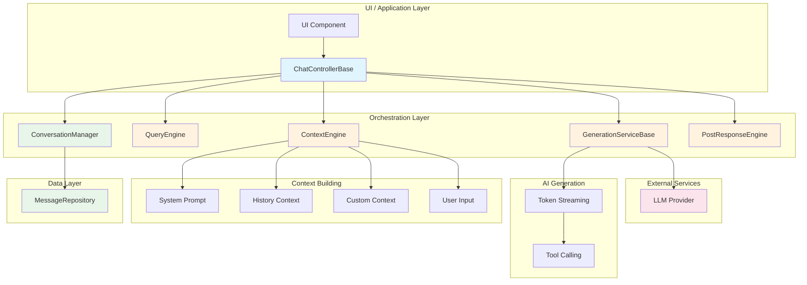

# Kai Engine

[](https://github.com/pckimlong/kai_engine/blob/main/LICENSE)
[](https://github.com/pckimlong/kai_engine/actions/workflows/ci.yml)

A modular, extensible AI chat engine built with a pipeline-based architecture.

## Packages

This repository is a monorepo containing the following packages:

| Package | Pub | Description |
|---------|-----|-------------|
| [kai_engine](packages/kai_engine/) | [](https://pub.dev/packages/kai_engine) | Core AI chat engine with pipeline-based architecture |
| [kai_engine_firebase_ai](packages/kai_engine_firebase_ai/) | [](https://pub.dev/packages/kai_engine_firebase_ai) | Firebase AI (Gemini) adapter for Kai Engine |
| [kai_engine_chat_ui](packages/kai_engine_chat_ui/) | [](https://pub.dev/packages/kai_engine_chat_ui) | Flutter chat UI widgets for Kai Engine |
| [prompt_block](packages/prompt_block/) | [](https://pub.dev/packages/prompt_block) | Structured prompt blocks for AI applications |

## Overview

The Kai Engine is a flexible framework for building AI-powered chat applications with a clean, modular architecture. It follows a pipeline-first pattern, allowing developers to easily customize and extend the processing pipeline with domain-specific logic.

### Architecture



## Features

- **Modular Pipeline Architecture**: Each processing step is a separate component that can be customized or replaced
- **Extensible Design**: Unlimited extensibility through component composition
- **Generic Type Support**: Full generic support for using your own message types
- **Stream-Based Responses**: Real-time streaming responses for better user experience
- **Optimistic UI Updates**: Immediate UI feedback with rollback on errors
- **Flexible Context Building**: Advanced prompt engineering with parallel and sequential context building
- **Tool Calling Support**: Native support for AI function/tool calling with type-safe schemas
- **Structured Prompt Blocks**: Create and manage structured prompt blocks
- **Post-Response Processing**: Process AI responses after generation with custom pipelines
- **Type Safety**: Strong typing throughout the system
- **Comprehensive Testability**: Designed for easy unit and integration testing

## Quick Start

### Installation

```yaml
dependencies:
  kai_engine: ^0.1.1
  kai_engine_firebase_ai: ^0.1.1  # For Firebase AI integration
  kai_engine_chat_ui: ^0.1.1      # For Flutter UI widgets
  prompt_block: ^0.1.1            # For structured prompts
```

### Basic Usage

```dart
import 'package:kai_engine/kai_engine.dart';
import 'package:kai_engine_firebase_ai/kai_engine_firebase_ai.dart';

// 1. Create the generation service
final generationService = FirebaseAiGenerationService(
  firebaseAi: FirebaseAI.googleAI(),
  config: GenerativeConfig(model: 'gemini-2.0-flash'),
);

// 2. Create a chat controller
final class MyChatController extends ChatControllerBase<MyMessage> {
  MyChatController({
    required super.conversationManager,
    required super.generationService,
  });

  @override
  ContextEngine build() => ContextEngine.builder([
    PromptTemplate.system("You are a helpful AI assistant."),
    PromptTemplate.buildSequential(HistoryContext()),
    PromptTemplate.input(),
  ]);

  @override
  GenerationExecuteConfig generativeConfigs(IList<CoreMessage> prompts) {
    return GenerationExecuteConfig.none();
  }
}

// 3. Use the controller
final controller = MyChatController(
  conversationManager: myConversationManager,
  generationService: generationService,
);

await controller.submit('Hello, world!');
```

### With Flutter UI

```dart
import 'package:kai_engine_chat_ui/kai_engine_chat_ui.dart';

KaiChatView(
  messages: messages,
  generationState: generationState,
  onSend: (text) => controller.submit(text),
  onCancel: controller.cancel,
)
```

## Documentation

See the individual package READMEs for detailed documentation:

- [kai_engine README](packages/kai_engine/README.md) - Core engine documentation
- [kai_engine_firebase_ai README](packages/kai_engine_firebase_ai/README.md) - Firebase AI integration
- [kai_engine_chat_ui README](packages/kai_engine_chat_ui/README.md) - Flutter UI widgets
- [prompt_block README](packages/prompt_block/README.md) - Structured prompt blocks

## Contributing

Contributions are welcome! Please read our [Contributing Guide](CONTRIBUTING.md) for details on how to submit pull requests, report issues, or request features.

## License

This project is licensed under the MIT License - see the [LICENSE](LICENSE) file for details.
