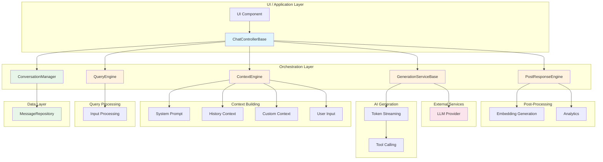

# Kai Engine

[](https://pub.dev/packages/kai_engine)
[](https://github.com/pckimlong/kai_engine/blob/main/LICENSE)

A modular, extensible AI chat engine built with a pipeline-based architecture.

## Overview

The Kai Engine is a flexible framework for building AI-powered chat applications with a clean, modular architecture. It follows a pipeline-first pattern, allowing developers to easily customize and extend the processing pipeline with domain-specific logic.

The core framework provides essential abstractions for building conversational AI applications while remaining unopinionated about concrete implementations, allowing maximum flexibility.

## Features

- **Modular Pipeline Architecture**: Each processing step is a separate component that can be customized or replaced.
- **Extensible Design**: Unlimited extensibility through component composition.
- **Generic Type Support**: Full generic support for using your own message types with MessageAdapter.
- **Stream-Based Responses**: Real-time streaming responses for better user experience.
- **Optimistic UI Updates**: Immediate UI feedback with rollback on errors.
- **Flexible Context Building**: Advanced prompt engineering with parallel and sequential context building.
- **Tool Calling Support**: Native support for AI function/tool calling with type-safe schemas.
- **Post-Response Processing**: Process AI responses after generation with custom pipelines.
- **Type Safety**: Strong typing throughout the system for better developer experience.
- **Comprehensive Testability**: Designed for easy unit and integration testing.

## Architecture

The Kai Engine follows a flexible architecture with clearly defined components:

1. **ChatControllerBase**: Orchestrates the entire chat flow and manages the interaction between components.
2. **ConversationManager**: Manages conversation state, persistence, and optimistic UI updates.
3. **GenerationServiceBase**: Abstracts AI model interactions and streaming responses.
4. **QueryEngineBase**: Processes and optimizes user input before context building.
5. **ContextEngine**: Builds conversation context with flexible template system.
6. **PostResponseEngineBase**: Processes AI responses after generation.
7. **MessageAdapterBase**: Bridges between internal CoreMessage and your custom message types.
8. **MessageRepositoryBase**: Abstracts message persistence layer.

### Data Flow Architecture



## Core Components

### ChatControllerBase

The main orchestrator that manages the complete chat flow:

```dart
abstract base class ChatControllerBase<TEntity> {
  Future<GenerationState<GenerationResult>> submit(
    String input, {
    bool revertInputOnError = false,
  });
  
  Stream<IList<CoreMessage>> get messagesStream;
  Stream<GenerationState<GenerationResult>> get generationStateStream;
  
  ContextEngine build();
  GenerationExecuteConfig generativeConfigs(IList<CoreMessage> prompts);
}
```

Key features:
- Handles the complete chat submission flow
- Manages loading states and error handling
- Provides streams for real-time UI updates
- Supports optimistic UI updates with rollback

### ConversationManager

Manages conversation state with optimistic updates:

```dart
// Create with async factory method
final conversationManager = await ConversationManager.create<MyMessage>(
  session: ConversationSession(id: 'conversation-123'),
  repository: myMessageRepository,
  messageAdapter: myMessageAdapter,
);

// Or use the built-in in-memory manager for simple use cases
final inMemoryManager = InMemoryConversationManager(
  session: ConversationSession(id: 'conversation-123'),
);

// API
conversationManager.addMessages(messages);
conversationManager.updateMessages(messages);
conversationManager.removeMessages(messages);
conversationManager.messagesStream; // Stream<IList<CoreMessage>>
```

Features:
- Optimistic UI updates for immediate feedback
- Automatic rollback on errors
- Pluggable persistence layer via MessageRepositoryBase
- Built-in `InMemoryConversationManager` for simple use cases

### ContextEngine

Flexible prompt building with template system:

```dart
abstract base class ContextEngine {
  List<PromptTemplate> get promptBuilder;
  
  Future<({CoreMessage userMessage, IList<CoreMessage> prompts})> generate({
    required IList<CoreMessage> source,
    required QueryContext inputQuery,
    CoreMessage? providedUserMessage,
  });
}
```

Features:
- Parallel and sequential context building
- Flexible template system with system prompts, user input, and custom contexts
- Built-in HistoryContext implementation

### PromptTemplate

Define your prompt structure with various template types:

```dart
// Using the built-in SimpleContextEngine
final contextEngine = SimpleContextEngine();

// Or create a custom context engine using the builder
final customEngine = ContextEngine.builder([
  PromptTemplate.system("You're kai, a useful friendly personal assistant."),
  PromptTemplate.buildSequential(HistoryContext()),
  PromptTemplate.input(),
]);

// Or use inline functions for dynamic context
final dynamicEngine = ContextEngine.builder([
  PromptTemplate.system("You are a helpful assistant."),
  PromptTemplate.buildParallelFn((input, messageId, context) async {
    // Fetch user context in parallel
    return [CoreMessage.system("User timezone: UTC+7")].lock;
  }),
  PromptTemplate.buildSequential(HistoryContext()),
  PromptTemplate.input((query, messages) async {
    // Optionally revise user input before sending
    return query.processedQuery;
  }),
]);
```

Template types:
- `PromptTemplate.system(String)` - Static system prompts
- `PromptTemplate.input([revision])` - User input placeholder with optional revision callback
- `PromptTemplate.buildParallel(ParallelContextBuilder)` - Parallel context building
- `PromptTemplate.buildSequential(SequentialContextBuilder)` - Sequential context building
- `PromptTemplate.buildParallelFn(Function)` - Parallel context with inline function
- `PromptTemplate.buildSequentialFn(Function)` - Sequential context with inline function

### QueryEngineBase

Process user input before context building:

```dart
abstract base class QueryEngineBase extends KaiPhase<QueryEngineInput, QueryContext> {
  @override
  Future<QueryContext> execute(QueryEngineInput input);
}
```

### PostResponseEngineBase

Process AI responses after generation:

```dart
abstract base class PostResponseEngineBase extends KaiPhase<PostResponseEngineInput, void> {
  @override
  Future<void> execute(PostResponseEngineInput input);
}
```

### Tool Calling

Native support for AI function/tool calling with type-safe schemas:

```dart
abstract base class ToolSchema<TDeclaration, TCall, TResponse> {
  Future<ToolResult<TResponse>> execute(TCall call);
  Future<ToolResponse> call(ToolCall toolCall);
}
```

Features:
- Type-safe tool definitions
- Automatic argument parsing
- Built-in success/failure handling
- Customizable response building

## Getting Started

Add the dependency to your `pubspec.yaml`:

```yaml
dependencies:
  kai_engine: ^0.1.1
```

Or install via command line:

```bash
dart pub add kai_engine
```

Create a custom chat controller:

```dart
import 'package:kai_engine/kai_engine.dart';

final class MyChatController extends ChatControllerBase<MyMessage> {
  MyChatController({
    required super.conversationManager,
    required super.generationService,
    super.queryEngine,
    super.postResponseEngine,
  });

  @override
  ContextEngine build() => ContextEngine.builder([
    PromptTemplate.system("You are a helpful AI assistant."),
    PromptTemplate.buildSequential(HistoryContext()),
    PromptTemplate.input(),
  ]);

  @override
  GenerationExecuteConfig generativeConfigs(IList<CoreMessage> prompts) {
    return GenerationExecuteConfig.none();
  }
}
```

Use the controller:

```dart
// Create controller instance
final controller = MyChatController(
  conversationManager: myConversationManager,
  generationService: myGenerationService,
);

// Submit a message
final result = await controller.submit('Hello, world!');

// Listen to messages
controller.messagesStream.listen((messages) {
  // Update UI with messages
});

// Listen to generation state
controller.generationStateStream.listen((state) {
  state.when(
    initial: () => print('Ready'),
    loading: (_) => print('Loading...'),
    streamingText: (text) => print('Streaming: $text'),
    functionCalling: (name) => print('Calling: $name'),
    complete: (result) => print('Done: ${result.responseText}'),
    error: (error) => print('Error: $error'),
  );
});

// Don't forget to dispose when done
controller.dispose();
```

## Testing

The Kai Engine is designed for comprehensive testing:

```dart
void main() {
  test('ChatController submits user input', () async {
    final mockConversationManager = MockConversationManager();
    final mockGenerationService = MockGenerationService();
    
    when(() => mockConversationManager.getMessages())
        .thenAnswer((_) async => const IList.empty());
    
    when(() => mockConversationManager.addMessages(any()))
        .thenAnswer((inv) async => inv.positionalArguments[0]);
    
    when(() => mockGenerationService.stream(any(), ...))
        .thenAnswer((_) => Stream.value(GenerationState.complete(result)));
    
    final controller = TestChatController(
      conversationManager: mockConversationManager,
      generationService: mockGenerationService,
      testContextEngine: TestContextEngine(),
    );
    
    final result = await controller.submit('Hello, world!');
    
    expect(result, isA<GenerationCompleteState<GenerationResult>>());
  });
}
```

## License

MIT License - see [LICENSE](../../LICENSE) file for details.
