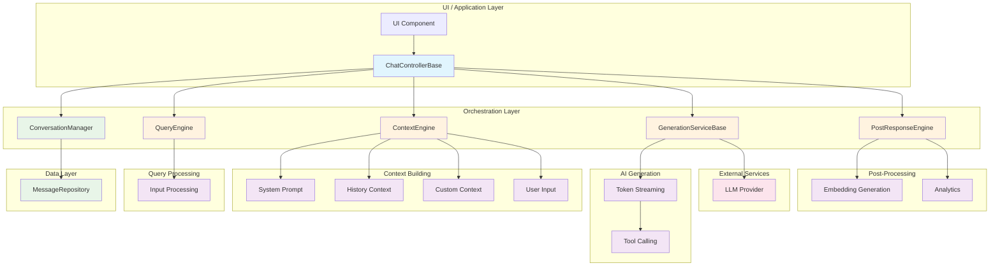

# Kai Engine

A modular, extensible AI chat engine built with a pipeline-based architecture.

> **Battle-tested in production** - Powers [Resonate](https://resonate-app-link.com), a modern AI chat application.

## Overview

The Kai Engine is a flexible framework for building AI-powered chat applications with a clean, modular architecture. It follows a pipeline-first pattern, allowing developers to easily customize and extend the processing pipeline with domain-specific logic.

The core framework provides essential abstractions for building conversational AI applications while remaining unopinionated about concrete implementations, allowing maximum flexibility.

### Built from Real-World Experience

This framework was born from developing [Resonate](https://resonate-app-link.com), ensuring it handles real production challenges:
- ✅ Scalable pipeline architecture
- ✅ Production-grade error handling  
- ✅ Flexible configuration system
- ✅ Stream-based real-time responses

## Features

- **Modular Pipeline Architecture**: Each processing step is a separate component that can be customized or replaced.
- **Extensible Design**: Unlimited extensibility through component composition.
- **Generic Type Support**: Full generic support for using your own message types with MessageAdapter.
- **Stream-Based Responses**: Real-time streaming responses for better user experience.
- **Optimistic UI Updates**: Immediate UI feedback with rollback on errors.
- **Flexible Context Building**: Advanced prompt engineering with parallel and sequential context building.
- **Tool Calling Support**: Native support for AI function/tool calling with type-safe schemas.
- **Template Engine**: Built-in flexible template engine for dynamic content generation.
- **Post-Response Processing**: Process AI responses after generation with custom pipelines.
- **Type Safety**: Strong typing throughout the system for better developer experience.
- **Comprehensive Testability**: Designed for easy unit and integration testing.

## Architecture

The Kai Engine follows a flexible architecture with clearly defined components:

1. **ChatControllerBase**: Orchestrates the entire chat flow and manages the interaction between components.
2. **ConversationManager**: Manages conversation state, persistence, and optimistic UI updates.
3. **GenerationServiceBase**: Abstracts AI model interactions and streaming responses.
4. **QueryEngine**: Processes and optimizes user input.
5. **ContextEngine**: Builds conversation context with flexible template system.
6. **PostResponseEngine**: Processes AI responses after generation.
7. **MessageAdapterBase**: Bridges between internal CoreMessage and your custom message types.
8. **MessageRepositoryBase**: Abstracts message persistence layer.

### Data Flow Architecture



## Core Components

### ChatControllerBase

The main orchestrator that manages the complete chat flow:

```dart
abstract base class ChatControllerBase<UIEntity, TEntity> {
  Future<GenerationState<UIEntity>> submit(String input, {bool revertInputOnError = false});
  Stream<IList<UIEntity>> get messagesStream;
  Stream<GenerationState<UIEntity>> get generationStateStream;
}
```

Key features:
- Handles the complete chat submission flow
- Manages loading states and error handling
- Provides streams for real-time UI updates
- Supports optimistic UI updates with rollback

### ConversationManager

Manages conversation state with optimistic updates:

```dart
class ConversationManager<T> {
  Future<void> addMessages(IList<CoreMessage> messages);
  Future<void> replacePlaceholderMessage(CoreMessage placeholder, CoreMessage actualMessage);
  Stream<IList<CoreMessage>> get messagesStream;
}
```

Features:
- Optimistic UI updates for immediate feedback
- Automatic rollback on errors
- Pluggable persistence layer via MessageRepositoryBase

### ContextEngine

Flexible prompt building with template system:

```dart
abstract base class ContextEngine {
  List<PromptTemplate> get promptBuilder;
  Future<(CoreMessage userMessage, IList<CoreMessage> prompts)> generate({
    required IList<CoreMessage> source,
    required QueryContext inputQuery,
    void Function(String name)? onStageStart,
  });
}
```

Features:
- Parallel and sequential context building
- Flexible template system with system prompts, user input, and custom contexts
- Built-in HistoryContext implementation

### Tool Calling

Native support for AI function/tool calling with type-safe schemas:

```dart
abstract base class ToolSchema<TDeclaration, TCall, TResponse> {
  Future<ToolResult<TResponse>> execute(TCall call);
  Future<ToolResponse> call(ToolCall toolCall);
}
```

Features:
- Type-safe tool definitions
- Automatic argument parsing
- Built-in success/failure handling
- Customizable response building

### FlexTemplate

Built-in flexible template engine:

```dart
final template = FlexTemplate('Hello {{name}}!');
print(template.render({'name': 'World'})); // "Hello World!"
```

Features:
- Variable interpolation: `{{name}}`
- Conditionals: `{{#if condition}}...{{#else}}...{{/if}}`
- Loops: `{{#each list as item}}...{{/each}}`
- Built-in functions: `{{upper(name)}}`, `{{date("yyyy-MM-dd")}}`
- Custom functions registration

## Getting Started

Add the dependency to your `pubspec.yaml`:

```yaml
dependencies:
  kai_engine:
    git:
      url: https://github.com/pckimlong/kai_engine.git
      ref: main
      path: packages/kai_engine
```

Create a custom chat controller:

```dart
class MyChatController extends ChatControllerBase<MyUIMessage, MyMessage> {
  MyChatController({
    required ConversationManager<MyMessage> conversationManager,
    required GenerationServiceBase generationService,
    required QueryEngine queryEngine,
    required PostResponseEngine postResponseEngine,
    required MessageAdapterBase<MyUIMessage> messageAdapter,
  }) : super(
    conversationManager: conversationManager,
    generationService: generationService,
    queryEngine: queryEngine,
    postResponseEngine: postResponseEngine,
    messageAdapter: messageAdapter,
  );

  @override
  ContextEngine build() => SimpleContextEngine();
}
```

## Testing

The Kai Engine is designed for comprehensive testing with built-in support for mocking:

```dart
void main() {
  test('ChatController submits user input', () async {
    // Arrange
    final controller = TestChatController(/* ... */);
    
    // Act
    final result = await controller.submit('Hello, world!');
    
    // Assert
    expect(result, isA<GenerationCompleteState>());
  });
}
```

Features:
- Comprehensive test suite included
- Mocking support with mocktail
- Stream testing utilities
- Integration test examples

## Production Use

The Kai Engine is battle-tested in production applications:

- **Resilient Error Handling**: Comprehensive error handling with automatic rollback
- **Performance Optimized**: Parallel processing where possible
- **Memory Efficient**: Proper resource disposal and stream management
- **Scalable Architecture**: Modular design allows for easy scaling

## License

MIT License - see [LICENSE](LICENSE) file for details.
